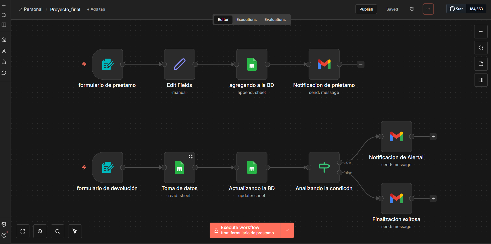

# 🚀 Sistema de Gestión de Inventario Automatizado (n8n)

  

Este proyecto resuelve la problemática de gestión manual de préstamos de equipos utilizando **n8n** como orquestador.

## 🛠️ Tecnologías utilizadas
* **n8n** (Lógica y automatización)
* **Google Sheets** (Base de datos)
* **Gmail** (Sistema de notificaciones)
* **Webhooks** (Captura de datos)

## 📋 Funcionalidades
1. **Registro de Préstamo:** Generación de ID único y notificación al usuario.
2. **Lógica de Devolución:** Búsqueda dinámica en BD y actualización de estado.
3. **Detección de Daños:** Alerta automática a soporte técnico si el equipo regresa dañado.

## ⚙️ Cómo usar este flujo
1. Descarga el archivo `sistema_control_prestamos.json`.
2. Importalo en tu instancia de n8n.
3. Conecta tus credenciales de Google Sheets y Gmail.
